# The Entity  
*Submission by Alexandra Lindt & Bonita von Gizycki*

### Links
- **APK File:**  [Download APK (Google Drive)](https://drive.google.com/drive/folders/1xj7_VVQ-KoY8Z6pDdaG2VWSu4Z7LELrJ?usp=sharing)

- **Slides:**  [Slide Deck for Documentation](https://docs.google.com/presentation/d/1LXdNGPU68z5NQPVYGeNyHZGeOa1bldxXgsVCxTjWDhU/edit?usp=sharing)

##  About the Project

The Entity is a narrative-driven VR experience focused on exploration, atmosphere, and subtle guidance through environmental design and sound.

Players explore a surreal landscape and follow environmental cues such as light, movement, and spatial audio. Throughout the experience, a mysterious interdimensional entity attempts to communicate with the player.

Progression is achieved by finding and assembling fragmented puzzle shards. The experience concludes once all fragments are reunited and a final connection with the entity is established.

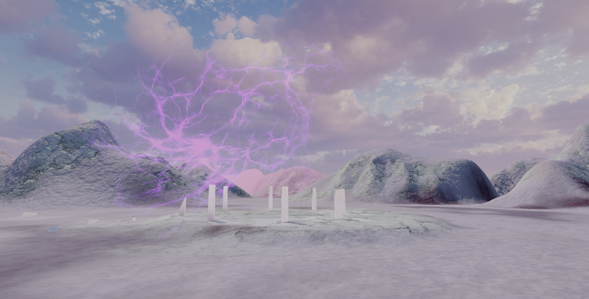

## Entity Design
The entity is designed as an abstract, non-humanoid presence rather than a character with a fixed form. 
Visually, the entity appears as a floating, spherical energy mass **composed of branching, lightning-like structures** contained within a translucent volume. Its form is shifting and pulsing, giving the impression of a living system.

The entity was created by combining multiple VFX textures and shaders from a VFX asset pack: a radial glow, a vein-like texture and a cloud structure. Subtle animation and pulsing light convey communication. As the player progresses through the puzzle, the entity reacts visually e.g. during motion or increased brightness.

## Environment Design

The environment is designed as a surreal, dream-like landscape with a stylized color palette. The terrain is predominantly pink and hilly, creating an otherworldly atmosphere that supports the narrative tone of the experience. 

**Unity’s terrain system** was used with recolored moss, stone, grass and snow/sand textures to match the aesthetic. 

**Additional assets** such as **fallen tree trunks, flowers, and trees** were sourced from a fantasy nature asset pack and integrated into the environment.
To further enhance the surreal quality, these assets were combined with force-field style shaders, giving them a subtle white, shimmering appearance.

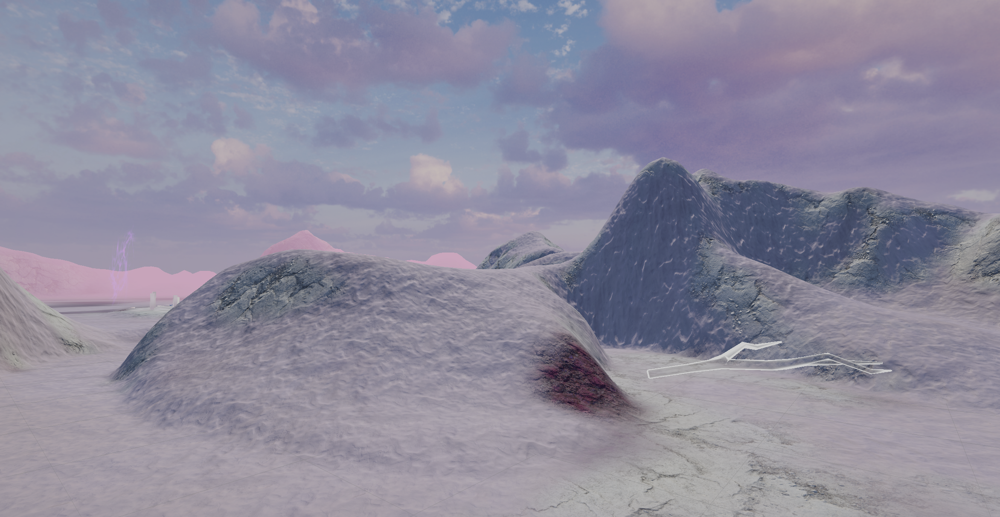
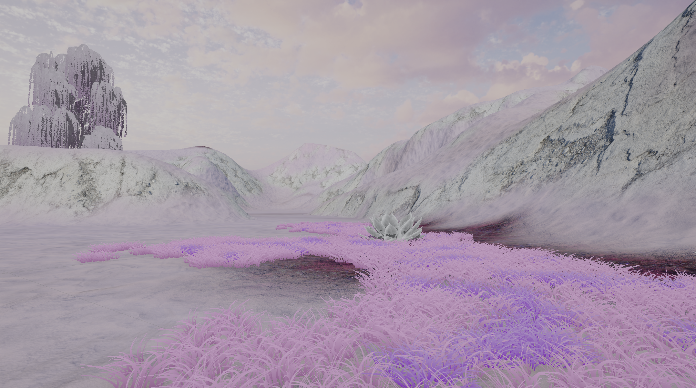
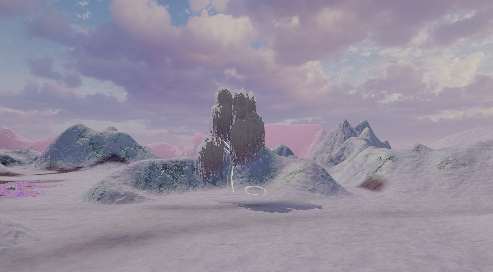

### Guiding Spheres & Environmental Pathways

Throughout the environment, guiding spheres act as subtle navigational elements that help orient the player without the use of explicit UI or objective markers.

The spheres emit a green glow and feature a gentle pulsing movement in their color, drawing the player’s attention through light and rhythm rather than instruction. Their visual behavior reinforces the idea that the player is being guided indirectly by the enironment and / or the mysterious entity.

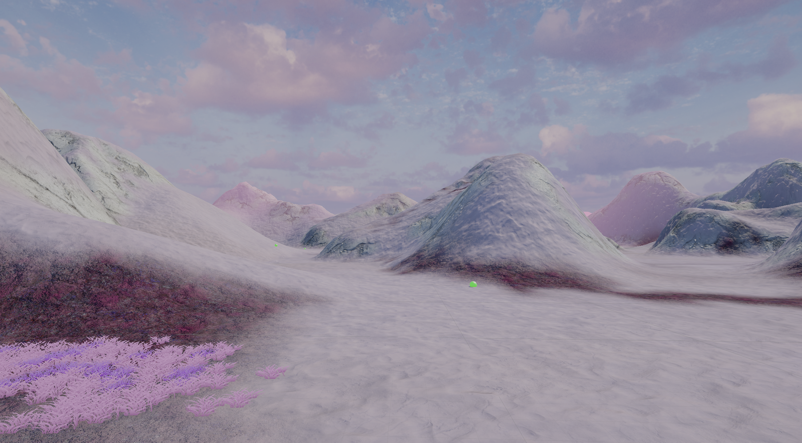

The environment contains two primary guiding-sphere paths, allowing the player a degree of freedom in how they move through the space. In addition to these paths, there are areas further away from the main routes that can be freely explored, encouraging curiosity and optional discovery.

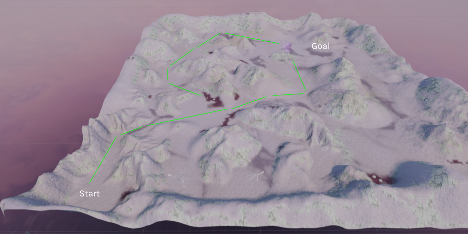

## Puzzle & Interaction with the Entity

Throughout the experience, the player is called for help by the entity with a generated human voice, reinforcing the feeling that there is something meaningful to discover “at the end of this world.” Guided by the voice and environmental cues, the player moves through the terrain toward the puzzle site.

After following the guiding spheres and optionally exploring the surrounding environment, the player eventually reaches the **central area of the world**. This space acts as a focal point and contains the main puzzle of the experience.

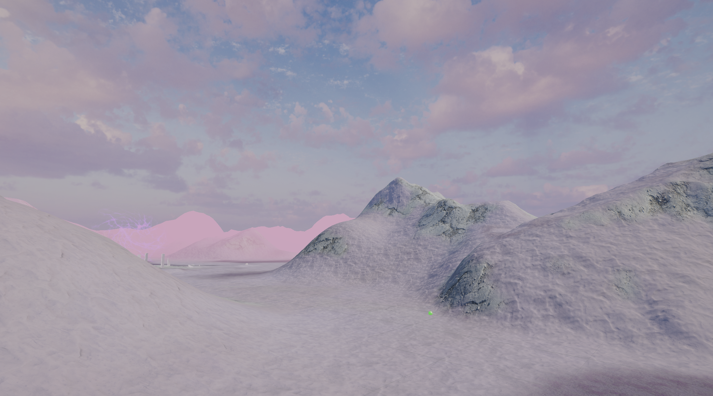

The puzzle itself is formed by a set of stone columns with mirror-like surfaces, arranged around a central stone structure. One of the columns appears broken, with **shards scattered nearby**. The fractured state of the puzzle visually communicates that something is incomplete and in need of restoration.

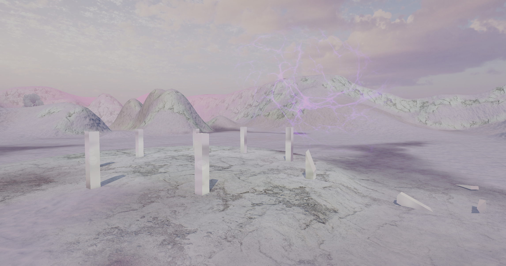

The player must use **ray-based grabbing** to pick up the scattered shards and place them onto the stone column base. As each shard is dropped over the column base, the shards **snap into place** and the **entity reacts** through changes in movement and visual intensity. 

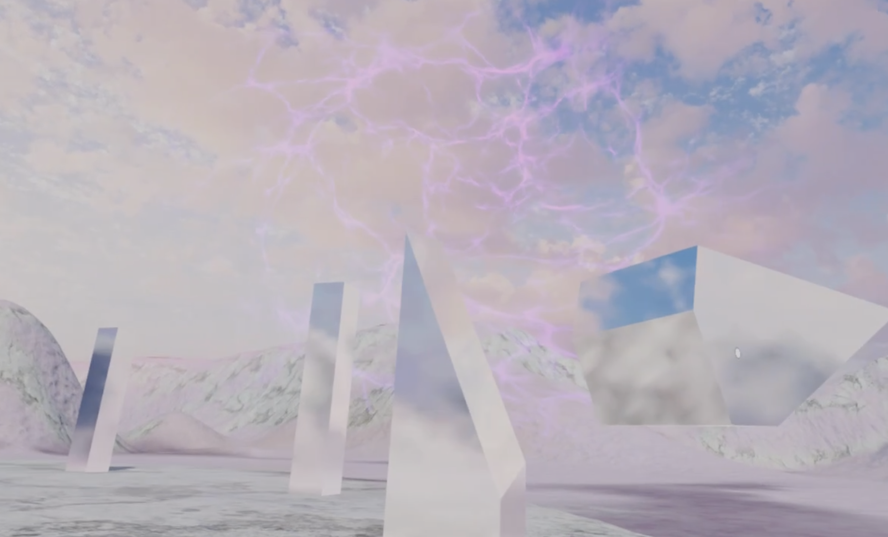
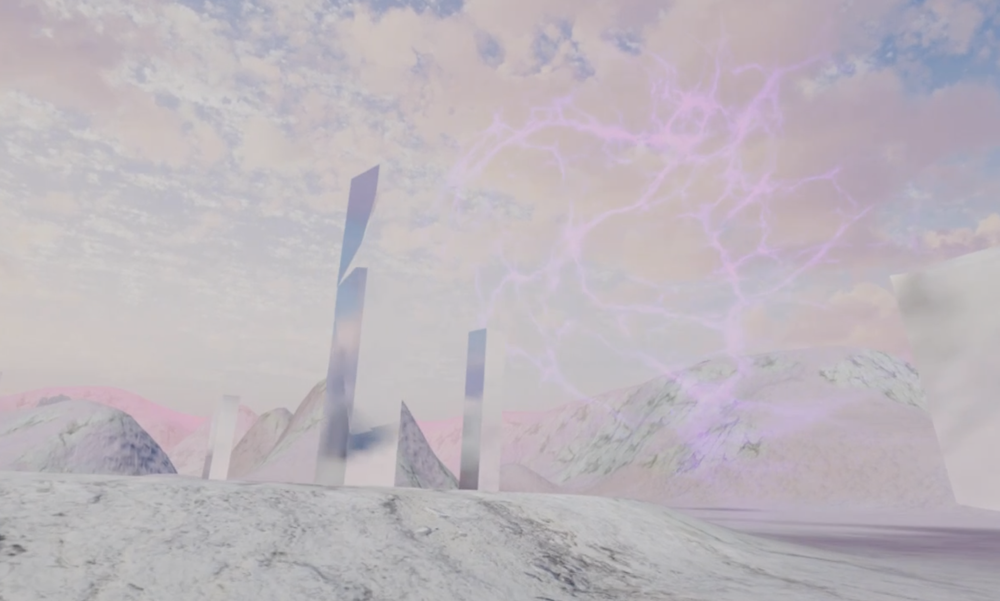
After all shards have been collected and reassembled, the puzzle is fully restored. With the final placement, the entity completes its communication and ascends upward, **leaving the world through a newly appearing tunnel of wind**, marking the conclusion of the experience.

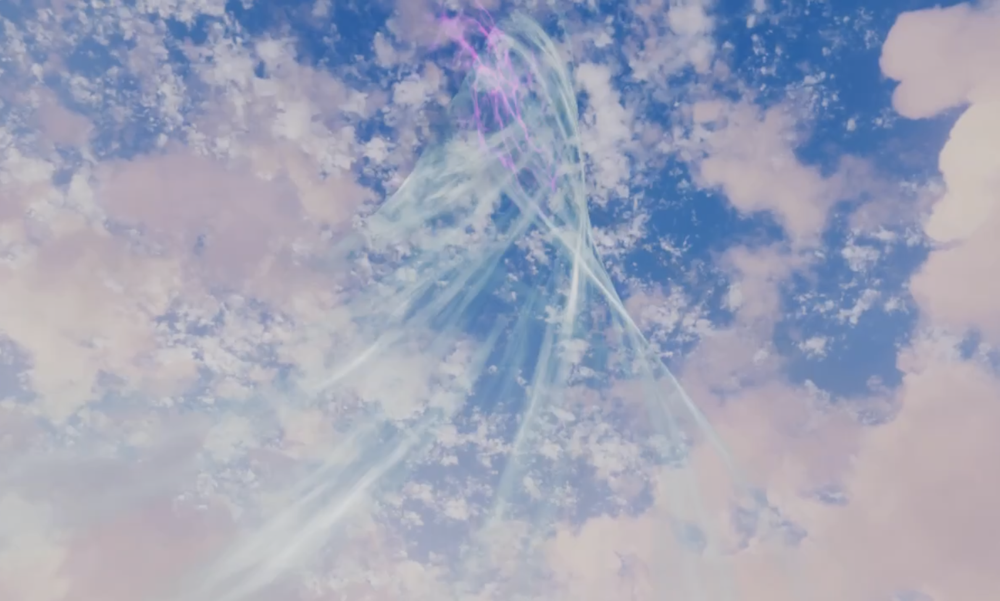

## Core Features
- Free exploration of a surreal VR environment
- Environmental storytelling without explicit UI
- Interaction with a reactive interdimensional entity
- Puzzle-based progression
- Spatial audio guidance 
- Environment soundscape + custom walking sound  

## Tech
- Unity
- Meta Quest 3 VR
- Blender (Puzzle assets)
- Photoshop (Adjusting texture colors)
- Ableton Live 12 (Sounds)

## 3rd Party Assets

**Textures / Terrain**
- [Unity Terrain Pack](https://assetstore.unity.com/packages/3d/environments/landscapes/terrain-sample-asset-pack-145808)

**Meshes**
- [Plants: Fantasy Nature Asset Pack](https://assetstore.unity.com/packages/3d/environments/fantasy/idyllic-fantasy-nature-260042)  
- [Flowers: Unity Terrain Pack](https://assetstore.unity.com/packages/3d/environments/landscapes/terrain-sample-asset-pack-145808)
- [Wind Tunnel: Prefab from All In 1 VFX Toolkit](https://assetstore.unity.com/packages/vfx/all-in-1-vfx-toolkit-206665)

**Shaders / VFX**
- [Force Field Shader: Ultimate 10 Shaders Pack](https://assetstore.unity.com/packages/vfx/shaders/ultimate-10-shaders-168611)
- [Skybox: Glorious Pink from AllSky Free](https://assetstore.unity.com/packages/2d/textures-materials/sky/allsky-free-10-sky-skybox-set-146014)
- [Entity: Built with the Creation Tool from All In 1 VFX Toolkit](https://assetstore.unity.com/packages/vfx/all-in-1-vfx-toolkit-206665)

**Sound**
- [2SOCKS_timeless_outro_sample.wav](https://freesound.org/people/2SOCKS/sounds/639588/)
- [Game music 3](https://freesound.org/people/CollectionOfMemories/sounds/746706/)
- [Suspension: Mellow Electro-Ambient Soundscape](https://freesound.org/people/kjartan_abel/sounds/531854/)
- [ElevenLabs](https://elevenlabs.io/?utm_source=google&utm_medium=cpc&utm_campaign=germany_brandsearch_brand_english&utm_id=22349495009&utm_term=11%20labs&utm_content=brand_-_11labs&gad_source=1&gad_campaignid=22349495009&gbraid=0AAAAAp9ksTEt33dtRElny6vfbDMrNy8JQ&gclid=Cj0KCQiAjJTKBhCjARIsAIMC44-uXLGa-9y5eErCONCXWneCZFZ8KnSw4jdC2vZ5YLvSzfuiW_yV8WUaArXIEALw_wcB)

